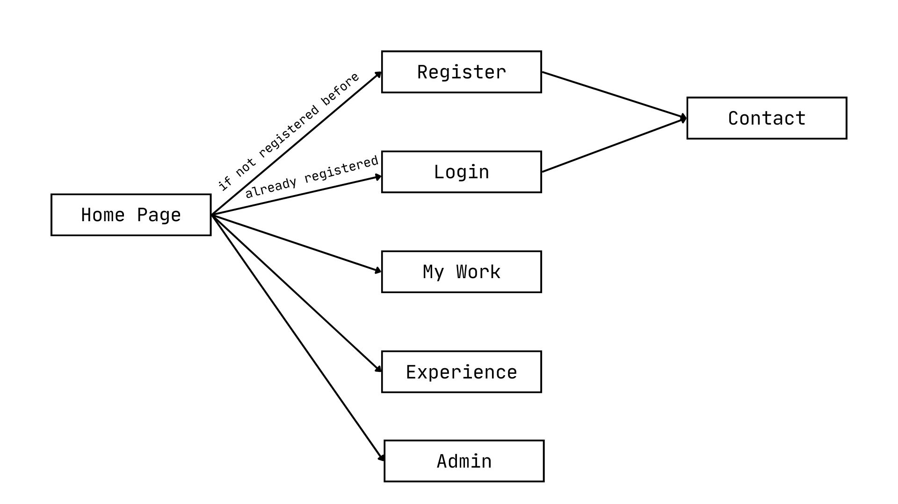

# CS-391-Project-Personal-Website
This is a personal website project prepared within the scope of CS 391 course, using ReactJS and NextJS.

### Project Description
Our project is a comprehensive personal website for a friend of ours designed to showcase professional experience, projects, and personal insights. The first page that the user encounters in our project is the Homepage. In this page, users are able to see a brief introduction to Berkecan. They can check his projects and work experience on the My Work and Experience pages respectively. Our website also allows users to contact Berkecan on the Contact page and enables them to Login or Register to the website depending on whether they registered before. This functionality is provided on the Login and Register pages. The Navbar class includes the navigation bar menu that is on every page of our project. Finally, the Admin page deploys crucial functionalities like displaying all users and members, updating the Email of a user, or removing them from the website.

### Usage Scenarios

**Scenario 1:** Checking the projects

1. User is in the Main Menu.
2. User clicks the My Work tab at the navigation bar.

   

**Scenario 2:** Checking the professional experience

1. User is in the Main Menu.
2. User clicks the Experience tab at the navigation bar.
3. User can see any experience of the website owner by hovering over a dot in the timeline.

**Scenario 3:** Contacting the website owner

1. User is in the Main Menu.
2. User clicks the Contact tab at the navigation bar.
3. User types in their email address, full name, and message.
*User should be registered in the website to contact the owner.*
4. User clicks the submit button.

**Scenario 4:** Registering to the website

1. User is in the Main Menu.
2. User clicks the Register tab at the navigation bar.
3. User types in their full name, email address, and their password twice to confirm the account.
4. User clicks the Register button.
5. A message pops up to say that the user has successfully registered. 

**Scenario 5:** Logging in the website

1. User is in the Main Menu.
2. User clicks the Login tab at the navigation bar.
3. User types in their email address and password if they are already registered.
4. User clicks the Login button.
5. A message pops up to say that the user has successfully signed in the website.

**Scenario 6:** Viewing registered users

1. User is in the Main Menu.
2. User clicks the Admin tab at the navigation bar.
3. User clicks the 'List All Members' button.
4. User can see the registered users.

**Scenario 7:** Viewing messages

1. User is in the Main Menu.
2. User clicks the Admin tab at the navigation bar.
3. User clicks the 'List All Messages' button.
4. User can see the registered users.

**Scenario 8:** Updating the email of a user

1. User is in the Main Menu.
2. User clicks the Admin tab at the navigation bar.
3. User types in their new Email address to the box if they are already registered.
4. User clicks the 'Update User's  Email' button.
5. A message pops up to say that the user has successfully changed their email address.

**Scenario 9:** Removing a user

1. User is in the Main Menu.
2. User clicks the Admin tab at the navigation bar.
3. User types in their email address if they are already registered.
4. User clicks the 'Delete User' button.
5. A message pops up to say that the user has successfully removed the user from the website database.

### Project members

**Çağla Cengiz:** 

- Design of the website 
- Created JSX and CSS files of Home Page, Experience, My Work, and Contact pages
- Implemented React Router and Navbar

**Deniz Naz Altaş:** 

- Created JSX and CSS files of Login, Register, and Admin
- Implemented Data Storage using Fake API
- Responsive web design

### External Libraries and Usage Purposes

- React-DOM: Used for allowing the navigation and routing between the pages
- JSON Server: Used for creating a mock Rest API to store and retrieve user data and messages
- React Icons: Used to be able to include icons in forms
- Pure CSS is used for responsive web design.

### Instructions for running the project

1. Open a terminal.

2. Navigate to the project directory using cd command:
        cd PATH-TO-THE-PROJECT\cs-391-project

3. Install the dependencies using "npm install" command.

4. Run this command to start the server:
        npm run server

5. Run this command to run the development server:
        npm run dev

 6. Open http://localhost:3000 in your browser
